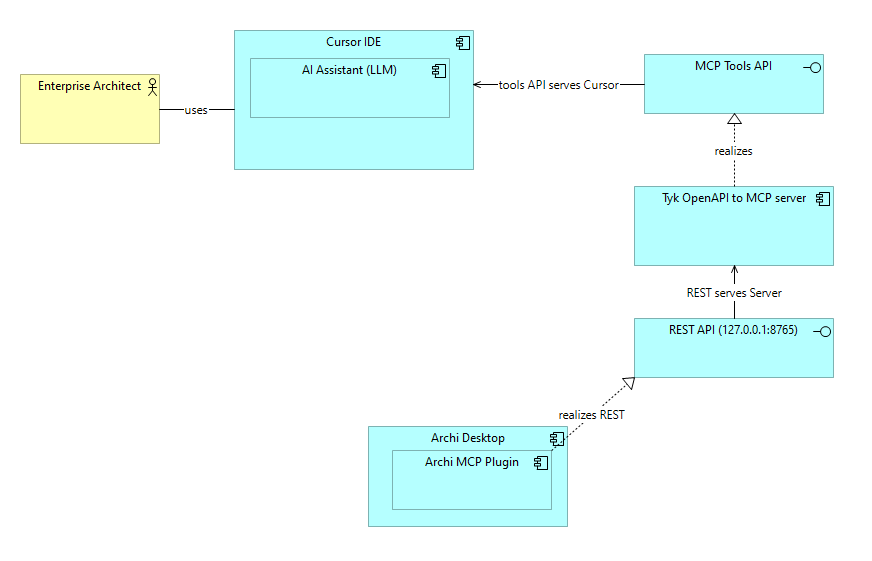

# Archi MCP Plugin

Предоставляет локальный HTTP API поверх текущей активной модели [Archi](https://archimatetool.com/). Служит бэкендом для MCP‑сервера [TykTechnologies/api-to-mcp](https://github.com/TykTechnologies/api-to-mcp) и может использоваться напрямую через REST (только на localhost).




## Возможности плагина
Позволяет LLM получать информацию из модели, вностить изменения в объекты и схемы, выполнять скрипты через REST API.


Дает LLM доступ к **текущей активной** модели Archi.
- Поиск элементов и связей в модели
- Создание и редактирование элементов
- Создание и редактирование связей
- Создание и редактирование диаграмм
  - Добавление элементов и связей на диаграмму, удаление с диаграммы, перемещение элементов
  - Поддержка вложенных элементов
  - Экспорт изображений диаграмм в PNG и SVG
- Получение списка возможных типов элементов и связей 
- Запуск скриптов (требует установленного плагина jArchi)
- Получение статуса и openapi.json

Большинство операций массовые, могут выполняться сразу несколькими элементами для ускорения работы.


## Установка 

### Archi 
Требования: Archi 5.x, запуск скриптов требует уставновленного плагина jArchi.

Скачать можно в [релизах](https://github.com/Diozavr/archi-mcp-plugin/releases).
Для установки достаточно поместить .zip файл в папку `dropins` в директории Archi.

Плагин стартует автоматически при старте Archi.

Порт HTTP сервера можно изменить в Archi → Preferences → MCP.

Внимание, API доступно **без авторизации** на http://localhost:8765/ (только локальные подключения).

### MCP 
Пример конфигурации для Cursor

```json
{
  "mcpServers": {
    "archi-mcp": {
      "command": "npx",
      "args": [
        "-y",
        "@tyk-technologies/api-to-mcp@latest",
        "--spec",
        "http://127.0.0.1:8765/openapi.json"
      ]
    }
  }
}
```


## Настройки Archi
- Порт HTTP сервера можно изменить в Archi → Preferences → MCP.
- Приоритет источников порта: Env `ARCHI_MCP_PORT` → Preferences → Default (`8765`).

### Toolbar (MCP Server)
Плагин добавляет отдельную панель инструментов "MCP" с переключателем "MCP Server". Иконка зелёная при запущенном сервере и красная при остановленном. Нажатие запускает или останавливает сервер без перезапуска Archi. Тултип показывает текущий порт (127.0.0.1:PORT). Если панели не видно, включите "MCP" в `Window → Customize Perspective… → Tool Bar Visibility`. При занятом порте отображается сообщение об ошибке.

## Самостоятельная сборка плагина 

Папка `com.archimatetool.mcp` является Eclipse проектом (PDE). См. подробные шаги в [BUILD.md](BUILD.md).


## TODO

Дальнейшее развитие 

[] Авторизация с API Key, установка его в настройках Archi
[] Работа плагина при запуске Archi в headless режиме
[] Описание сборки плагина
[] Полноценная автоматизация сборки плагина 
[] Проработка промптов для работы с диаграмами